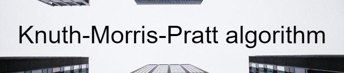

## What project do?
___
Example of Knuth-Morris-Pratt text search algorithm and naive algorithm.

## How to use?
___
Just import project to CodeBlocks and compile/run. If you wish you could use another environment by using only main.cpp file.
## Program execution
___
Program has user-friendly menu.

<!--https://banner.godori.dev/-->
<!--https://shields.io/-->
<!--https://carbon.now.sh/-->